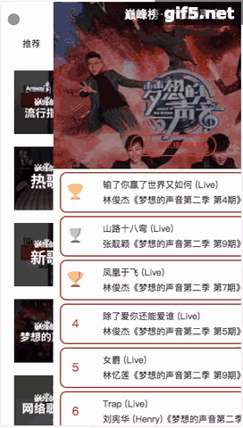

# MusicPlayer —— 基于Vue2实现的类似QQ音乐、网易云音乐的复杂移动端单页应用。

## 概述

使用Vue2制作的移动端复杂SPA单页应用，实现了歌手页面、歌手详情、播放器内核、搜索、播放列表等，不断编写业务组件，并逐步对组件进行抽离，抽取出基础组件。

复杂移动端布局，对CSS进行重复代码的抽取，减少代码耦合。

实现很多动画、过渡，实现类似原生APP的体验。

做了图片、路由的懒加载、base64压缩等性能优化，提升用户体验。

数据来源是抓取的QQ音乐后台接口。

## 项目支撑

### 底层框架

MVVM框架：Vue.js (2.x)

### 工具支撑

* 脚手架工具：vue-cli

* CSS处理器：使用styls编写css，对css进行抽取，减少代码耦合；使用PostCss对css代码进行兼容处理。

* 自动化构建工具：webpack

* 代码风格规范：eslint

### 构架支撑

* 基础组件库：通过不断编写业务组件抽取出来的13个公共组件。

* 状态管理：使用vuex做状态管理、实现多个组件之间的数据互通。

* 路由：使用vue-router进行多路由的跳转。

* 与后端通信：使用vue2推荐的axios，以及使用jsonp进行跨域。

* 滚动插件：Scroll

* 懒加载：vue-lazyload图片懒加载、webpack路由懒加载

## 实现功能

* 轮播图推荐、热门歌单推荐——后台接口获取信息，前台展示。

* 歌手信息、slider滚动——根据热门、拼音将歌手分类，点击右侧slider滚动到相应类的歌手。

* 歌手详情——展示歌手的大图、根据歌曲热门程度依此展示该歌手歌曲。

* 播放器——播发、暂停、切换上一曲、切换下一曲、切换播放模式、最小化播放器、拖动改变播放进度等。

* 播放列表——当前播放的歌曲会自动被添加到播放列表，播放列表中的歌曲可以被删除，可以点击切歌。

* 清空播放列表——删除掉播放列表的所有歌曲。

* 歌词滚动——根据当前进度修改当前播放的歌词、歌词随播放进度而滚动。

* 歌曲图片——播放歌曲时，歌曲图片进行旋转，暂停播放停止旋转。

* 我喜欢——点击当前歌曲播放界面的心形图标，可以将歌曲添加到我喜欢的列表。

* 排行榜——列表形式展示所有榜单。

* 榜单详情——类似歌手详情，实现了列表展示当前榜单的歌曲，带有歌曲当前排名。

* 播放模式切换——实现单曲、随机、顺序等多种播放模式的切换。

* 随机播放全部歌曲——歌手详情、榜单详情、播放历史中的功能。

* 搜索歌曲——响应用户输入，实时查询当前输入信息。

* 热门搜索——展示当前热门搜索。

* 搜索历史——保存用户搜索历史，并显示在热门搜索下。

* 清空搜索历史——清空搜索历史的所有歌曲。

* 个人中心——展示我喜欢的歌曲列表和最近听的歌曲列表。

* 我喜欢的——将标记为我喜欢的歌曲列表展示。

* 最近听的——将最近的歌曲列表展示。

## 动图预览

**推荐**


**歌手和详情** 


**播放器** 


**排行和详情**



**搜索和历史**


**我喜欢和最近播放**


## 目录结构

<pre>
.
├── README.md
├── build // 环境配置、webpack配置
├── config // 环境配置
├── dist // bulid下的目录
├── index.html
├── npm-debug.log
├── package.json
├── prod.server.js
├── src
│   ├── App.vue
│   ├── api // 抽取出的Api
│   │   ├── config.js
│   │   ├── rank.js
│   │   ├── recommend.js
│   │   ├── search.js
│   │   ├── singer.js
│   │   └── song.js
│   ├── base // 基础组件
│   │   ├── confirm // 提示框
│   │   ├── listview // 包裹列表的组件
│   │   ├── loading // 加载中
│   │   ├── no-result // 没有东西、没找到
│   │   ├── progress-bar // 播放按钮
│   │   ├── progress-circle // 进度圆圈
│   │   ├── scroll // 滚动组件
│   │   ├── seach-box // 搜索
│   │   ├── search-list // 搜索列表框
│   │   ├── slider // 点击滚动到相应类别
│   │   ├── song-list // 歌曲列表
│   │   ├── switches // 我喜欢或最近播放的切换
│   │   └── top-tip // 我喜欢或最近播放的top
│   ├── common
│   │   ├── fonts
│   │   ├── image
│   │   ├── js // 公共JS
│   │   │   ├── cache.js // 缓存
│   │   │   ├── config.js // 配置
│   │   │   ├── dom.js // dom操作
│   │   │   ├── jsonp.js
│   │   │   ├── mixin.js // vue mixin
│   │   │   ├── singer.js
│   │   │   ├── song.js
│   │   │   └── util.js // 常用工具封装
│   │   └── stylus // css
│   ├── components
│   │   ├── add-song // 添加到播放列表
│   │   ├── disc // 描述
│   │   ├── m-header // 首屏header
│   │   ├── music-list // 歌曲列表
│   │   ├── player // 播放器内核
│   │   ├── playlist // 播放列表
│   │   ├── rank // 排行
│   │   ├── recommend // 热门
│   │   ├── search // 搜索
│   │   ├── singer // 歌手
│   │   ├── singer-detail // 歌手详情
│   │   ├── suggest // 查询结果
│   │   ├── tab // 排行、热门、搜索、歌手的路由
│   │   ├── top-list // 排行列表
│   │   └── user-center // 用户中心
│   ├── main.js
│   ├── router // 路由
│   └── store // vuex
│       ├── actions.js // action
│       ├── getters.js // getter
│       ├── index.js 
│       ├── mutation-types.js // mutationType
│       ├── mutations.js // mutation
│       └── state.js // state
└── static // 静态资源

43 directories, 97 files
</pre>

## 总结

一个挺复杂的项目，懂得了中等复杂规模的应用的开发，掌握了vue的更高级应用，对组件化开发再一次加深了理解，理解了原生App体验交互的实现原理，也对移动端样式布局更加熟练，掌握了webPack更高级的配置。

## 运行

``` 
# clone

git clone https://github.com/Merlin-Liu/Vue-Music-App.git

cd vue-music-app

# dev

npm run dev

# build

npm run build
```
